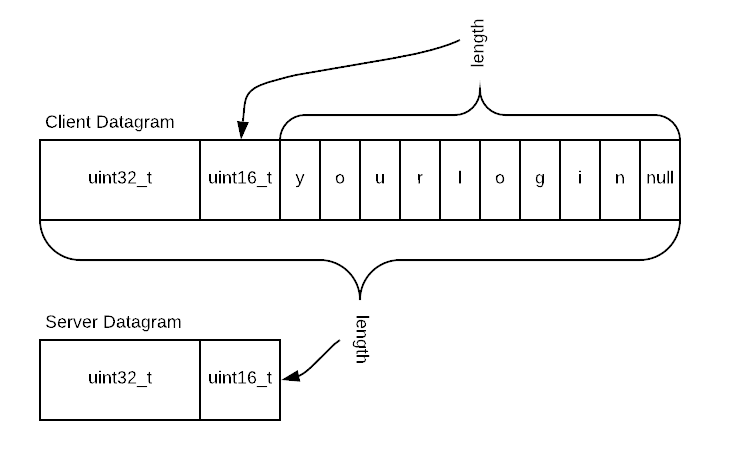

# UDP Speed Test

Writing both a client and server is made difficult because both programs
must be built in parallel. It does not good to implement features in one
that are not available in the other. To ease this burden for you, I have
supplied my reference client and server executables.

These should be in a zip file contained in this repository.

## Project description

In this project, you will write a UDP client and server to exchange
information. The client will blast UDP datagrams at the server. The
server will extract some information from the datagram it receives and
send its own datagram back to the client. Each datagram the client sends
should in theory generate a unique paired response from the server.

Both client and server should run as fast as possible. The client will
use non-blocking I/O. As UDP is a datagram protocol with no assurance of
delivery, it is a *feature* of this project to lose packets.

This project teaches a number of things.

- Systems programming. Systems programming is different from all the
  programming you may have done in your career so far. It is down, dirty
  and dangerous.

- Initializing a UDP client and server using Berkeley sockets. Berkeley
  sockets are required knowledge, in my view, if you are going to  learn
  about network programming. Modern languages have lots of higher level
  abstractions to hide the details you are learning here. With that
  said, you will have a chance to use higher level abstractions later in
  the course.

- Working with pointers, unterminated buffers and pointers. Also
  pointers. Did I mention pointers? Systems programming. It's what's
  real. No safety nets here.

## Byte ordering

Not covered in this project are the wonders of byte ordering over a
network. Different architectures may order bytes differently (big endian
versus little endian). To avoid these issues, there is a defined
*network ordering*. Even though you are going from Intel to Intel, your
code must include handling of conversion to and from network ordering.
If your project skips this, you will be penalized.

## Required to run with full optimization (when not debugging)

You will be running on the same internal Carthage network. As such, the
connections may appear to be more reliable than UDP really is. It is
essential that you test your programs when compiled with the optimizer
on full bore. Once you are beyond debugging (using the ```-g``` compiler
flag) you must test with the ```-O3``` compiler flag.

## Adherence to this specification

You have my client and server. Your correct output should match mine in
all non-data-dependent respects. While I appreciate student
customizations such as *"You ran the program wrong you losing loser"* I
will deduct points if your output strays from my own.

In the event that *my* code does not adhere to this specification, the
code supersedes the specification. Also, please let me know because I
may have made a mistake that I would like to fix.

## Client program

You have **no** latitude with respect to datagram format or options
supported. For example, you must support the ```-h```, ```-s```, and
```-p``` options. You *may* implement a ```-d``` option for your own
use. For example, your ```-d``` option might send *one* packet instead
of the 262 thousand packets required otherwise.

The client program will send a fixed number of properly initialized
ClientDatagram packets to the server. In a perfect world the client
program will receive back the same number of ServerDatagrams.

Except if you program a ```-d``` option otherwise, you must send a
specific number of packets:

```c++
#define NUMBER_OF_DATAGRAMS		(1 << 18)
```

Each pair of datagrams (a client to server datagram causes a matching
server to client datagram) are associated with one another using a
```sequence_number``` member. As the client transmits, it memorizes that
it sent a particular sequence number. As it receives acknowledgements,
it removes its memory of that sequence number. An ```STL``` ```set``` is
a good candidate data structure.

If an acknowledgement is received for a sequence number you have no
record of or no longer have a record of, you must print a message such
as ```ERROR unknown sequence number received: -the sequence number-```
and **keep going**.

Many error conditions must be checked. Fatal errors must cause
```main()``` to return a non-zero error code.

### File names and makefile

You must use ```structure.hpp``` and ```defaults.hpp``` as given. If you
make any changes to these files you risk not working with my reference
client and / or server.

**You must provide a makefile that includes targets for the client,
server and a ```clean``` target that deletes an existing built client
and server.**

**BE REALLY CAREFUL WHEN YOU TEST THE clean TARGET - back up your code
first until you get it right.**

**FAILURE TO INCLUDE A MAKEFILE WILL CAUSE POINTS TO BE DEDUCTED.**

### Command line options

You will use getopt to implement command line options. With the
exception of ```-d``` the following is **required**:

- ```-h``` This prints the help text you will find below. **Exit** the
  program with a return code of 0 after the help text is printed.

- ```-d``` If present, you can switch on any debugging features you
  might necessary. I will not be testing this. This is for you.

   If given, turns on any debugging features you wish to add. This is
   handy rather than changing the program to turn on and off debugging
   features and having to recompile. In a general sense, remember
   checking the debugging option slows down your code so putting a check
   inside an innermost loop executed a lot should only be done with due
   consideration.

- ```-s server_ip_address``` The default server IP address is 127.0.0.1.
This address is your machine no matter what machine you are on. You must
support this option correctly or your work may not work.

- ```-p port_number``` The default port number is 39390. You must
support this option correctly or your work may not work.

   Be sure to print out the port number *before* converting it to
   network byte ordering. Please be observant than this.

You should match the following output from ```-h``` (client shown):

```text
./client options:
-h displays help
-d debug mode
-s server_address ... defaults to 127.0.0.1
-p port_number ... defaults to 39390
```

### More information on getopt

```getopt``` defines an ```extern``` named ```optarg.``` It is a ```char
*```. Do not confuse this with a C++ ```string```.

Your option string must look something like this (for the client):
```"s:hp:d"```. The colons after s and p mean there is a required option
expected.

Neither ```-s``` nor ```-p``` are *required* as defaults are defined.

### Client Datagram

The client datagram is the one that the client sends to the server. It
is found in ```structure.hpp```. You may **not** alter this structure in
**any way**.

```c++
struct ClientDatagram
{
	uint32_t sequence_number;
	uint16_t  payload_length;
};

struct ServerDatagram
{
	uint32_t  sequence_number;
	uint16_t  datagram_length;
};
```

The ```ClientDatagram``` has a payload following the bytes made up the
structure above. The payload is your Carthage College login name
followed by a null byte. The null byte is included in the payload length
and is to be transmitted to the server.

If your login name is ```jsmith```, the bytes sent are these plus a null
terminator. Therefore the payload length must be set to 7. There are six
letters in ```jsmith``` plus one more for the null terminator.

To be explicitly clear, payload length is the number of bytes in the
payload. A string plus one. This is *different* from the number of total
number of bytes you will send to the server. See next for *example*
code:

```c++
char * login_name = (char *) "jsmith";
size_t payload_length = strlen(login_name) + 1;
size_t client_datagram_length = sizeof(ClientDatagram) + payload_length;
```

Compare this to the datagram length sent from the server back to the
client. Datagram length sent from the server to the client in the
```ServerDatagram``` should be the number of total bytes sent by the
client to the server. Using the variable names from the example code
above, the value of ```datagram_length``` in the ```ServerDatagram```
should be the same as ```client_datagram_length```.

There is a diagram below in case this text is not clear.

### Testing your client

You must send exactly ```NUMBER_OF_DATAGRAMS``` packets. This means you
must be prepared to keep track of the status of that many. However, for
debugging purposes you might want to send a very small number of packets
so that you aren't overwhelmed by debugging output.

Second hint, you probably want debugging output. Use the ```-d``` option
to turn on and off the debugging output easily.

You must run a server first. It will listen for packets and respond.

You must test your client against your own server. And you must test
your client against my server.

### Error checking and exit values

Pay attention to this - it gives hints about error conditions you should
be checking for. Failure to check for these errors will result in point
deductions.

| Sample output statement | Exit Code |
|:----------------------- |:---------:|
|cerr << "ERROR wrong datagram_length: " << v << " should be: " << datagram_length << endl;<br/>cerr << "Sequence number: " << sequence_number << endl;| keep going |
|cerr << "Unable to allocate space for buffer: " << datagram_length << " bytes." << endl;| 1 |
|perror("ERROR opening socket");| 1 |
|perror("ERROR setting non-blocking");| 1|
|cerr << "ERROR, no such host: " << server_address << endl;| 1 |
|cerr << "ERROR Number of bytes sent [" << bytes_sent << "] does not match message size [" << datagram_length << "]" << endl;| 1 |
|cerr << "ERROR failure in packet reception" << endl;| 1 |

Remember that your client may send packets *so* quickly that with a
slower network connection, you run out of buffer space for outgoing
packets. This means you might get an error on send - this is *different*
from getting the wrong number of bytes back from send.

## Additional guidance on the ClientDatagram

You saw the structure above. That structure has two members. A properly
formatted ClientDatagram has three members, the last being the payload.
Dynamically allocate enough space for the defined structure plus the
complete payload. Recall this line from above:

```c++
size_t client_datagram_length = sizeof(ClientDatagram) + payload_length;
```

Pointer arithmetic is used to locate the first byte of the payload.

## Server Program

The server program must be run before your client program. A properly
written server can service multiple clients at the same time since
datagrams do not have any sense of persistent connection. Everything the
server needs to know to acknowledge a packet is contained in the
received packet (and associated metadata).

Upon receiving a packet from a client, the server attempts to interpret
the bytes as a ClientDatagram. It will create an acknowledgement by
sending back the same sequence number contained in the received packet.
It also sends back the total number of bytes in the received datagram.
In other words, the number of bytes returned by recvfrom.

***Unlike the client**, the server can block on reads. Servers respond
to client requests so may block on reception waiting for these.

### Command line options

You must support the following command line options:

- ```-h``` Displays help information and exits. See additional
information in the description of the Client program.

- ```-d``` If present, you can switch on any debugging features you
might necessary. I will not be testing this. This is for you.

- ```-p port_number``` The default port number is 39390. If you need to
override this, you can specify a different port number in this way.

You must match the following output from ```-h```:

```text
./server options:
-h displays help
-d enables debugging features
-p port_number ... defaults to 39390
-v verbose mode - prints the received payloads
```

### File names

Your server program file name must be ```server.cpp```. Your entire
program must be implemented in one file. You must use
```structure.hpp``` and ```defaults.hpp``` as given.

### Server Datagram

The server datagram is the one that the server sends back to the client.
It is found in ```structure.hpp```. You may **not** alter this structure
in **any way**. You can see it above in the discussion about the client
datagram.

The server datagram needs no special memory tricks as it is a fixed
size.

### Testing your server

Your server will have to work against your own client, of course. I will
also provide an ARM version of my client. Your server must support my
client.

### Error checking and exit values

Pay attention to this - it gives hints about error conditions you should
be checking for. Failure to check for these errors will result in point
deductions.

| Sample output statement | Exit Code |
|:----------------------- |:---------:|
|perror("ERROR opening socket");|1|
|perror("ERROR on binding");|1|
|cerr << "ERROR in sendto to: " << buffer << endl;<br/>perror("ERROR in sendto:");|no exit|

## To be crystal clear re: lengths



## Allocating and releasing memory

Points will be deducted if there is any way to leak memory. In virtually
all cases anything you allocate with ```new``` or ```malloc``` must be
freed with ```delete``` or ```free``` respectively.

## Sending and receiving must happen in an asynchronous manner

*Your client program will be sending as fast as possible. The server
will be responding as quickly as it can. The networking stack on both
sides have a fairly limited number of packets they can buffer before
dropping them. Therefore, your client must interleave transmission and
reception.

**This bears repeating:** The client cannot send out 262,000 packets and
*then* start reading. In the inner loop you must both transmit and
attempt to read.

The server can block on reading because it has nothing to do if there is
no packet. If there **is** a packet, it replies immediately. Again, the
blocking / non-blocking discussion is for the client.

Reading from something normally blocks until there is something to read.
This is not acceptable for the client. The UDP socket you create will
need to be set to non-blocking. Do this with the ```fcntl``` system call
on an already opened DGRAM (UDP) socket.

Here's the Beej comments on [fcntl](https://beej.us/guide/bgnet/html/index-wide.html#fcntlman).

Once the socket is set to non-blocking, attempting to read when there
isn't anything there will return immediately. It is up to you to tell
the difference between an error and there simply no data being
available. Check ```errno``` for two values - ```EAGAIN``` and
```EWOULDBLOCK```. If ```errno``` is either of these there wasn't really
an error - just nothing to read.

## Some of the Berkeley sockets related functions you will use

You will use ```sendto``` and ```recvfrom``` to transmit and receive.
These will both be done over the same socket.

The ```socket``` function opens a socket. When you call this function
you specify that the socket is to speak UDP rather than another
protocol. UDP sends and receives datagrams.

You will need the family of functions related to ```ntohl``` and the
reverse ```htonl```. These functions ensure a predictable ordering of
bytes within an ```int``` (for example). Failure to use these functions
will lead to tears.

```fcntl``` is used to set the non-blocking mode on the socket. See
above.

```gethostbyname``` will be used to turn a character / human readable
server name into a number.

## Handy links

[A fairly complete cheat
sheet](http://beej.us/guide/bgnet/html/single/bgnet.html "Beej")

## What to turn in

I must be able to run ```make``` to create your client and your server.
Include all source files (and makefile) to make this possible. Points
will be deducted if I must figure out how to compile your project
